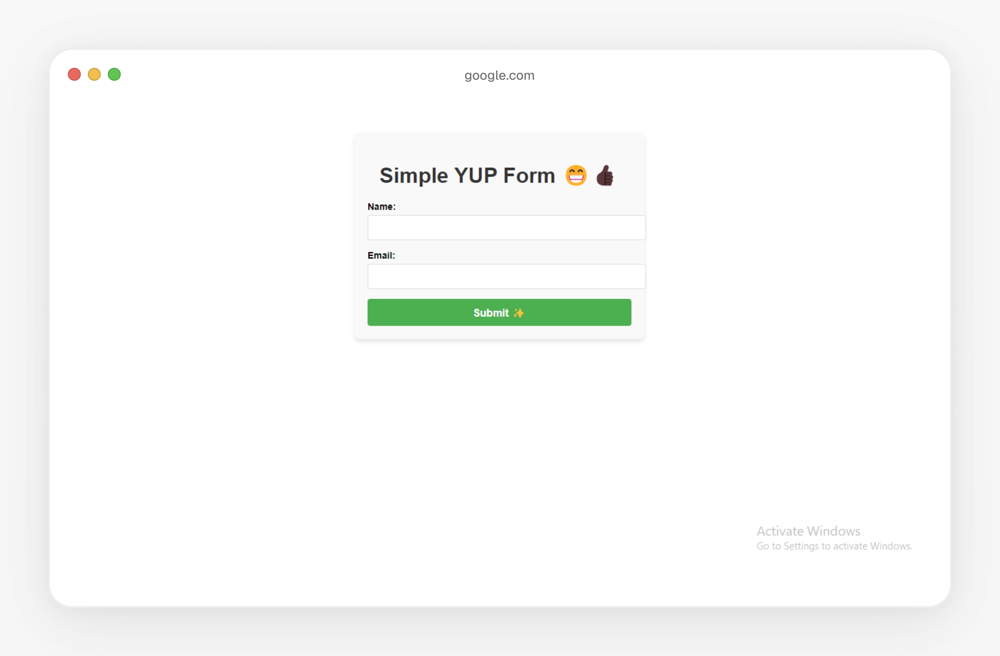
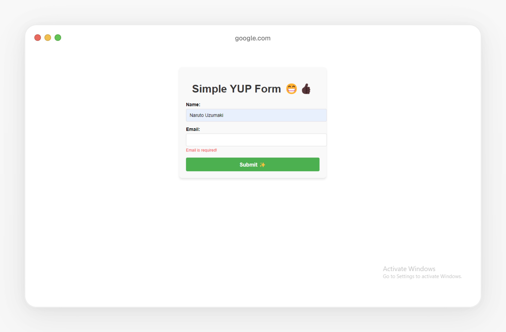

# Form Component with Yup Validation

This project is a simple React-based form that demonstrates the use of **Yup** for form validation. It allows users to input their name and email address while validating the inputs for correctness and displaying real-time error messages.

## Features
- **Form Validation with Yup:** Ensures the `name` and `email` fields meet the required criteria.
- **User Feedback:** Real-time error messages to guide the user.
- **Dynamic State Management:** Uses React's `useState` hook to manage form data and errors.
- **Custom Styling:** Utilizes an external CSS file (`App.css`) for styling.

## Project Structure
```
src/
├── components/
│   └── MyForm.js        # The main form component
├── App.css              # External CSS file for styling
├── App.js               # Entry point for rendering the form
└── index.js             # Application root
```

## Installation

1. **Clone the Repository**
   ```bash
   git clone https://github.com/Lawani-EJ/YUP-form-validation
   YUP-form-validation
   ```

2. **Install Dependencies**
   ```bash
   npm install
   ```

3. **Start the Application**
   ```bash
   npm start
   ```

## Usage
1. Navigate to the application in your browser (default: `http://localhost:3000`).
2. Fill in the `Name` and `Email` fields.
3. Click the **Submit** button to validate the form.

### Validation Rules
- **Name:** Required field.
- **Email:** Must be a valid email format (e.g., `example@domain.com`).

### Error Handling
- Displays error messages below the respective input fields when validation fails.
- Alerts the user with "Form is valid! 🚀" when the form is successfully validated.

## Dependencies
- **React**: ^18.0.0
- **Yup**: ^1.0.0

## Customization
You can extend this project by:
- Adding more fields with their respective Yup validation rules.
- Integrating it with an API to submit the form data.
- Enhancing the styling for a more modern look.

## External Styles (App.css)
Below is an example of the `App.css` file used for styling:
```css
.form-container {
  max-width: 400px;
  margin: auto;
  padding: 20px;
  border: 1px solid #ccc;
  border-radius: 10px;
  box-shadow: 0 2px 5px rgba(0, 0, 0, 0.1);
  background-color: #f9f9f9;
}

.form-group {
  margin-bottom: 20px;
}

.label {
  display: block;
  font-weight: bold;
  margin-bottom: 5px;
}

.input {
  width: 100%;
  padding: 10px;
  border: 1px solid #ccc;
  border-radius: 5px;
}

.error {
  color: red;
  font-size: 0.9em;
  margin-top: 5px;
}

.button {
  width: 100%;
  padding: 10px;
  background-color: #007bff;
  color: white;
  border: none;
  border-radius: 5px;
  cursor: pointer;
}

.button:hover {
  background-color: #0056b3;
}
```

## Screenshots
### Form View


### Error Messages


## License
This project is licensed under the [MIT License](LICENSE).

## Author
Built with ❤️ by [John](https://github.com/Lawani-EJ).

# React + Vite

This template provides a minimal setup to get React working in Vite with HMR and some ESLint rules.

Currently, two official plugins are available:

- [@vitejs/plugin-react](https://github.com/vitejs/vite-plugin-react/blob/main/packages/plugin-react/README.md) uses [Babel](https://babeljs.io/) for Fast Refresh
- [@vitejs/plugin-react-swc](https://github.com/vitejs/vite-plugin-react-swc) uses [SWC](https://swc.rs/) for Fast Refresh
